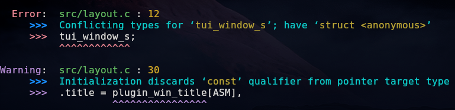

# GCC error formatter



## Overview

- Uses the `-fdiagnostics-format=json` flag
- Works with Make et al. as long as the only `[{` JSON objects `}]` in the output are GCC's

## Usage

### As import

```python
from gccf import format_gcc_output
command = 'g++ -Wall -Wextra -fdiagnostics-format=json test2.cpp'
format_gcc_output (command)
```

### As replacement command for `gcc`

Make sure that the shebang path at the top of the script points to your python's location.

```bash
$ cp gccf.py ~/.local/bin/gcf
$ gcf -Wall -Wextra -o my_app main.c
```

## Color configuration

Personalize the colors at the top of `gccf.py`.<br>

## Development

```bash
$ ./run_tests
$ ./get_unformatted_errors
```
